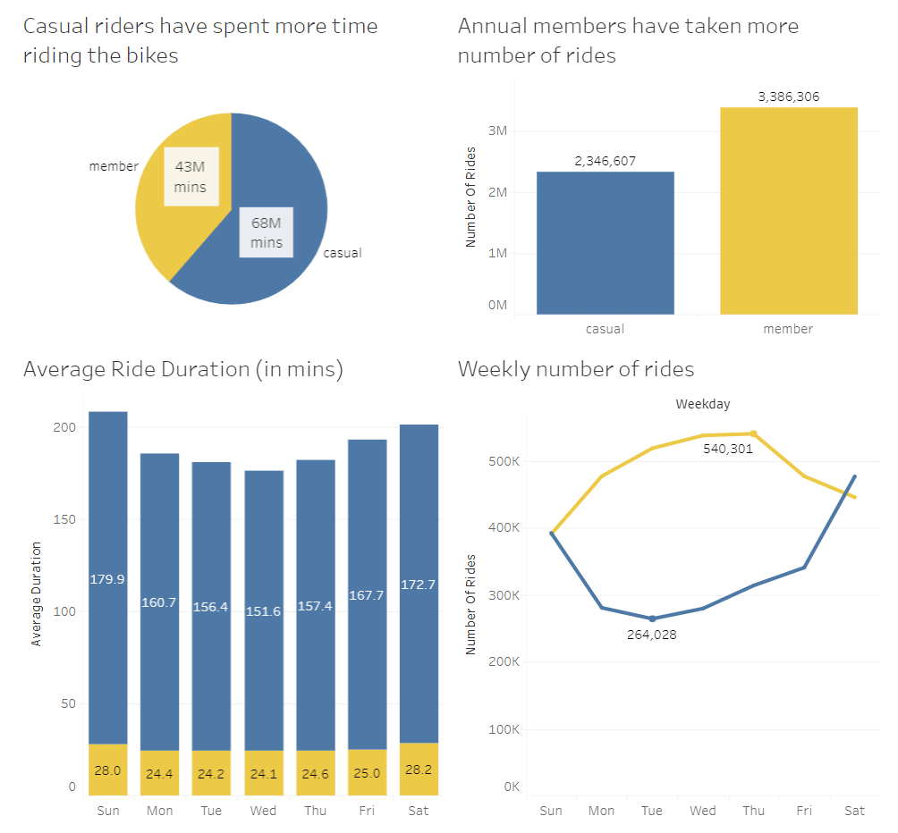

# Introduction & Background

-   For this case study, we are tasked to assist the marketing analyst
    team at Cyclistic, a Chicago-based bike-share company.
-   The company has a fleet of 5,824 bicycles and 692 stations across
    Chicago.
-   Cyclistic’s current marketing strategy has three pricing plans.
    -   Single-ride pass, full-day pass and annual membership.

    -   Users of Single-ride and full-day passes are referred to as
        casual riders.

    -   Users of annual membership are referred to as Cyclistic members.
-   Lily Moreno, Director of Marketing at Cyclistic believes number of
    cyclistic members will be key to growth.
-   Lily has assigned you the question to answer: How do annual members
    and casual riders use Cyclistic bikes differently?

# Phase 1 - Ask

**Business Task** - Analyze data to help develop marketing strategy for
converting casual riders into cyclistic members.

**Stakeholders** - Executive team, Lily Moreno, and Marketing Analytics
team.

# Phase 2 - Prepare

**Data Source:**

-   The previous 12 months of Cyclistic trip data of period - December
    2021 to November 2022.

-   Comprises of 12 ‘.csv’ files.

-   [Source link](https://divvy-tripdata.s3.amazonaws.com/index.html)
    (by Motivational International Inc.)

-   [Data License
    Agreement](https://ride.divvybikes.com/data-license-agreement)

**ROCCC analysis:**

-   Reliable - Data is sourced from Divvy, a program of the Chicago
    Department of Transportation (CDOT), which owns the city’s bikes,
    stations and vehicles.
    [(Source)](https://ride.divvybikes.com/about) - **Good**.

-   Original - Data is made available by Motivate International Inc.,
    now acquired by Lyft Inc., which operates the City of Chicago’s
    Divvy bicycle sharing service. [(Source
    1)](https://ride.divvybikes.com/data-license-agreement) [(Source
    2)](https://siliconangle.com/2018/11/29/lyft-finalizes-motivate-acquisition-become-largest-bike-sharing-company-us/) -
    **Good**.

-   Comprehensive - The datasets includes information ride id, bike
    type, start & end (time, station name, station id, longitude,
    latitude), member status. - **Good**

-   Current - The data is most recent, last 12 months (Dec 2021 to Nov
    2022). - **Good**

-   Cited - Data is cited to Lyft Inc. under the Data License
    Agreement. - **Good**

**Privacy:** There are no personally identifiable information in the
data. Rather, each ride observation is denoted as a “ride\_id”.

**Concerns:** There is no uniquely identifying user information in the
data (such as a pseudo user-id), therefore it cannot be ascertained if a
particular ride is by a new or a repeating customer.

# Phase 3 - Process

    # Setting up the environment
    library(tidyverse)

    ## ── Attaching packages ─────────────────────────────────────── tidyverse 1.3.2 ──
    ## ✔ ggplot2 3.4.0      ✔ purrr   0.3.5 
    ## ✔ tibble  3.1.8      ✔ dplyr   1.0.10
    ## ✔ tidyr   1.2.1      ✔ stringr 1.4.1 
    ## ✔ readr   2.1.3      ✔ forcats 0.5.2 
    ## ── Conflicts ────────────────────────────────────────── tidyverse_conflicts() ──
    ## ✖ dplyr::filter() masks stats::filter()
    ## ✖ dplyr::lag()    masks stats::lag()

    library(lubridate) #for date functions

    ## Loading required package: timechange
    ## 
    ## Attaching package: 'lubridate'
    ## 
    ## The following objects are masked from 'package:base':
    ## 
    ##     date, intersect, setdiff, union

    library(skimr)

    # all 12 datasets have same column headers. Therefore, merging datasets.
    setwd("D:/RStudio/datasets")
    bikeshare_data <- rbind(
      read.csv("202112-divvy-tripdata.csv"),
      read.csv("202201-divvy-tripdata.csv"),
      read.csv("202202-divvy-tripdata.csv"),
      read.csv("202203-divvy-tripdata.csv"),
      read.csv("202204-divvy-tripdata.csv"),
      read.csv("202205-divvy-tripdata.csv"),
      read.csv("202206-divvy-tripdata.csv"),
      read.csv("202207-divvy-tripdata.csv"),
      read.csv("202208-divvy-tripdata.csv"),
      read.csv("202209-divvy-tripdata.csv"),
      read.csv("202210-divvy-tripdata.csv"),
      read.csv("202211-divvy-tripdata.csv")
    )
    head(bikeshare_data)

    ##            ride_id rideable_type          started_at            ended_at
    ## 1 46F8167220E4431F electric_bike 2021-12-07 15:06:07 2021-12-07 15:13:42
    ## 2 73A77762838B32FD electric_bike 2021-12-11 03:43:29 2021-12-11 04:10:23
    ## 3 4CF42452054F59C5 electric_bike 2021-12-15 23:10:28 2021-12-15 23:23:14
    ## 4 3278BA87BF698339  classic_bike 2021-12-26 16:16:10 2021-12-26 16:30:53
    ## 5 6FF54232576A3B73 electric_bike 2021-12-30 11:31:05 2021-12-30 11:51:21
    ## 6 93E8D79490E3AB11  classic_bike 2021-12-01 18:28:36 2021-12-01 18:38:03
    ##             start_station_name start_station_id           end_station_name
    ## 1     Laflin St & Cullerton St            13307        Morgan St & Polk St
    ## 2        LaSalle Dr & Huron St     KP1705001026 Clarendon Ave & Leland Ave
    ## 3 Halsted St & North Branch St     KA1504000117       Broadway & Barry Ave
    ## 4 Halsted St & North Branch St     KA1504000117      LaSalle Dr & Huron St
    ## 5     Leavitt St & Chicago Ave            18058     Clark St & Drummond Pl
    ## 6         Wabash Ave & 16th St           SL-012         Wells St & Polk St
    ##   end_station_id start_lat start_lng  end_lat   end_lng member_casual
    ## 1   TA1307000130  41.85483 -87.66366 41.87197 -87.65097        member
    ## 2   TA1307000119  41.89441 -87.63233 41.96797 -87.65000        casual
    ## 3          13137  41.89936 -87.64852 41.93758 -87.64410        member
    ## 4   KP1705001026  41.89939 -87.64854 41.89488 -87.63233        member
    ## 5   TA1307000142  41.89558 -87.68202 41.93125 -87.64434        member
    ## 6         SL-011  41.86038 -87.62581 41.87260 -87.63350        member

    str(bikeshare_data)

    ## 'data.frame':    5733451 obs. of  13 variables:
    ##  $ ride_id           : chr  "46F8167220E4431F" "73A77762838B32FD" "4CF42452054F59C5" "3278BA87BF698339" ...
    ##  $ rideable_type     : chr  "electric_bike" "electric_bike" "electric_bike" "classic_bike" ...
    ##  $ started_at        : chr  "2021-12-07 15:06:07" "2021-12-11 03:43:29" "2021-12-15 23:10:28" "2021-12-26 16:16:10" ...
    ##  $ ended_at          : chr  "2021-12-07 15:13:42" "2021-12-11 04:10:23" "2021-12-15 23:23:14" "2021-12-26 16:30:53" ...
    ##  $ start_station_name: chr  "Laflin St & Cullerton St" "LaSalle Dr & Huron St" "Halsted St & North Branch St" "Halsted St & North Branch St" ...
    ##  $ start_station_id  : chr  "13307" "KP1705001026" "KA1504000117" "KA1504000117" ...
    ##  $ end_station_name  : chr  "Morgan St & Polk St" "Clarendon Ave & Leland Ave" "Broadway & Barry Ave" "LaSalle Dr & Huron St" ...
    ##  $ end_station_id    : chr  "TA1307000130" "TA1307000119" "13137" "KP1705001026" ...
    ##  $ start_lat         : num  41.9 41.9 41.9 41.9 41.9 ...
    ##  $ start_lng         : num  -87.7 -87.6 -87.6 -87.6 -87.7 ...
    ##  $ end_lat           : num  41.9 42 41.9 41.9 41.9 ...
    ##  $ end_lng           : num  -87.7 -87.7 -87.6 -87.6 -87.6 ...
    ##  $ member_casual     : chr  "member" "casual" "member" "member" ...

    colnames(bikeshare_data)

    ##  [1] "ride_id"            "rideable_type"      "started_at"        
    ##  [4] "ended_at"           "start_station_name" "start_station_id"  
    ##  [7] "end_station_name"   "end_station_id"     "start_lat"         
    ## [10] "start_lng"          "end_lat"            "end_lng"           
    ## [13] "member_casual"

Formatting proper data-types:

    #started_at & ended_at columns formatted as datetime types
    bikeshare_data$started_at = as.POSIXct(bikeshare_data$started_at, format="%Y-%m-%d %H:%M:%S", tz="UTC")
    bikeshare_data$ended_at = as.POSIXct(bikeshare_data$ended_at, format="%Y-%m-%d %H:%M:%S", tz="UTC")

Creating new columns:

    #New columns to calculate ride length & day of the week.
    bikeshare_data <- bikeshare_data %>% 
      mutate(ride_length = ended_at - started_at) %>% 
      mutate(day_of_week = weekdays(started_at))

    #data values of ride_length converted from secs to mins
    bikeshare_data$ride_length <- as.numeric(bikeshare_data$ride_length/60)

    #New column denoting start date & time separately
    bikeshare_data <- separate(bikeshare_data, started_at, into=c('start_date', 'start_time'), sep=" ")
    bikeshare_data$start_date <- as.Date(bikeshare_data$start_date, format="%Y-%m-%d")

    #Check for null values

    sum(is.na(bikeshare_data$ride_id))

    ## [1] 0

    sum(is.na(bikeshare_data$rideable_type))

    ## [1] 0

    sum(is.na(bikeshare_data$start_date))

    ## [1] 0

    sum(is.na(bikeshare_data$start_time))

    ## [1] 0

    sum(is.na(bikeshare_data$ended_at))

    ## [1] 0

    sum(is.na(bikeshare_data$start_station_name))

    ## [1] 0

    sum(is.na(bikeshare_data$start_station_id))

    ## [1] 0

    sum(is.na(bikeshare_data$end_station_name))

    ## [1] 0

    sum(is.na(bikeshare_data$end_station_id))

    ## [1] 0

    sum(is.na(bikeshare_data$start_lat))

    ## [1] 0

    sum(is.na(bikeshare_data$start_lng))

    ## [1] 0

    sum(is.na(bikeshare_data$end_lat))

    ## [1] 5874

    sum(is.na(bikeshare_data$end_lng))

    ## [1] 5874

    sum(is.na(bikeshare_data$member_casual))

    ## [1] 0

    sum(is.na(bikeshare_data$ride_length))

    ## [1] 0

    sum(is.na(bikeshare_data$day_of_week))

    ## [1] 0

    # The data has 11748 null values, primarily in the end latitude & longitude columns. We are choosing to ignore them.

-   There are certain ride\_length values which are zero or negative
    i.e. for these observations values of started\_at &gt; ended\_at.

<!-- -->

    bikeshare_negative <- bikeshare_data[bikeshare_data$ride_length<=0,]
    glimpse(bikeshare_negative)

    ## Rows: 538
    ## Columns: 16
    ## $ ride_id            <chr> "D0EC4FF4822C75D5", "0A3055D2697FD60F", "2A1F2810FC…
    ## $ rideable_type      <chr> "classic_bike", "classic_bike", "electric_bike", "e…
    ## $ start_date         <date> 2021-12-12, 2021-12-01, 2021-12-19, 2021-12-11, 20…
    ## $ start_time         <chr> "16:32:15", "17:36:30", "11:05:27", "14:10:03", "19…
    ## $ ended_at           <dttm> 2021-12-12 16:32:15, 2021-12-01 17:36:30, 2021-12-…
    ## $ start_station_name <chr> "Mies van der Rohe Way & Chicago Ave", "Clinton St …
    ## $ start_station_id   <chr> "13338", "638", "TA1305000032", "13085", "13085", "…
    ## $ end_station_name   <chr> "Mies van der Rohe Way & Chicago Ave", "Clinton St …
    ## $ end_station_id     <chr> "13338", "638", "", "", "", "", "", "", "", "", "",…
    ## $ start_lat          <dbl> 41.89694, 41.87832, 41.88204, 41.92956, 41.92962, 4…
    ## $ start_lng          <dbl> -87.62176, -87.64098, -87.64159, -87.70788, -87.707…
    ## $ end_lat            <dbl> 41.89694, 41.87832, 41.88000, 41.93000, 41.93000, 4…
    ## $ end_lng            <dbl> -87.62176, -87.64098, -87.64000, -87.71000, -87.710…
    ## $ member_casual      <chr> "member", "member", "casual", "casual", "member", "…
    ## $ ride_length        <dbl> 0, 0, 0, 0, 0, 0, 0, 0, 0, 0, 0, 0, 0, 0, 0, 0, 0, …
    ## $ day_of_week        <chr> "Sunday", "Wednesday", "Sunday", "Saturday", "Tuesd…

    #There are 538 such observations. We'll remove them from the main dataset.
    bikeshare_data <- bikeshare_data[bikeshare_data$ride_length>0,]

# Phase 4 - Analyze

    #Analysis on ride_length (in mins)
    summary(bikeshare_data$ride_length)

    ##     Min.  1st Qu.   Median     Mean  3rd Qu.     Max. 
    ##     0.02     5.83    10.30    19.42    18.50 41387.25

    # The 3rd quartile is 18.5 mins, while the max value is 41387.25 mins
    # Checking for count of values equal or greater than 1 day i.e. >1440 mins
    sum(bikeshare_data$ride_length >= 1440)

    ## [1] 5395

    # 5395 rides were equal or greater than 1 day

    #Comparing casual and annual members
    aggregate(bikeshare_data$ride_length ~ bikeshare_data$member_casual, FUN=mean)

    ##   bikeshare_data$member_casual bikeshare_data$ride_length
    ## 1                       casual                   29.11159
    ## 2                       member                   12.70980

    aggregate(bikeshare_data$ride_length ~ bikeshare_data$member_casual, FUN=median)

    ##   bikeshare_data$member_casual bikeshare_data$ride_length
    ## 1                       casual                  13.050000
    ## 2                       member                   8.833333

    aggregate(bikeshare_data$ride_length ~ bikeshare_data$member_casual, FUN=min)

    ##   bikeshare_data$member_casual bikeshare_data$ride_length
    ## 1                       casual                 0.01666667
    ## 2                       member                 0.01666667

    aggregate(bikeshare_data$ride_length ~ bikeshare_data$member_casual, FUN=max)

    ##   bikeshare_data$member_casual bikeshare_data$ride_length
    ## 1                       casual                   41387.25
    ## 2                       member                    1559.90

    #Average ride length for both members, by each weekday
    aggregate(bikeshare_data$ride_length ~ bikeshare_data$member_casual + bikeshare_data$day_of_week, FUN=mean)

    ##    bikeshare_data$member_casual bikeshare_data$day_of_week
    ## 1                        casual                     Friday
    ## 2                        member                     Friday
    ## 3                        casual                     Monday
    ## 4                        member                     Monday
    ## 5                        casual                   Saturday
    ## 6                        member                   Saturday
    ## 7                        casual                     Sunday
    ## 8                        member                     Sunday
    ## 9                        casual                   Thursday
    ## 10                       member                   Thursday
    ## 11                       casual                    Tuesday
    ## 12                       member                    Tuesday
    ## 13                       casual                  Wednesday
    ## 14                       member                  Wednesday
    ##    bikeshare_data$ride_length
    ## 1                    27.79129
    ## 2                    12.50088
    ## 3                    29.23465
    ## 4                    12.27430
    ## 5                    32.53700
    ## 6                    14.15156
    ## 7                    34.08668
    ## 8                    14.04935
    ## 9                    25.57554
    ## 10                   12.30066
    ## 11                   25.97937
    ## 12                   12.14857
    ## 13                   24.70289
    ## 14                   12.06669

    #Analyzing ridership data by user type and weekday
    bikeshare_data %>% 
      mutate(weekday=wday(start_date, label = TRUE)) %>%          #created a new weekday column, as ordinal type
      group_by(member_casual, weekday) %>% 
      summarise(number_of_rides = n(), average_duration=mean(ride_length)) %>% 
      arrange(member_casual, weekday)

    ## `summarise()` has grouped output by 'member_casual'. You can override using the
    ## `.groups` argument.

    ## # A tibble: 14 × 4
    ## # Groups:   member_casual [2]
    ##    member_casual weekday number_of_rides average_duration
    ##    <chr>         <ord>             <int>            <dbl>
    ##  1 casual        Sun              392077             34.1
    ##  2 casual        Mon              280445             29.2
    ##  3 casual        Tue              264028             26.0
    ##  4 casual        Wed              279364             24.7
    ##  5 casual        Thu              313705             25.6
    ##  6 casual        Fri              340462             27.8
    ##  7 casual        Sat              476526             32.5
    ##  8 member        Sun              390456             14.0
    ##  9 member        Mon              476903             12.3
    ## 10 member        Tue              518623             12.1
    ## 11 member        Wed              537711             12.1
    ## 12 member        Thu              540301             12.3
    ## 13 member        Fri              476873             12.5
    ## 14 member        Sat              445439             14.2

    #Analyzing ridership data by user type, weekday, rideable type
    bikeshare_data %>% 
      mutate(weekday=wday(start_date, label = TRUE)) %>%          #created a new weekday column, as ordinal type
      group_by(member_casual, weekday, rideable_type) %>% 
      summarise(number_of_rides = n(), average_duration=mean(ride_length), total_duration=sum(ride_length)) %>% 
      arrange(member_casual, weekday)

    ## `summarise()` has grouped output by 'member_casual', 'weekday'. You can
    ## override using the `.groups` argument.

    ## # A tibble: 35 × 6
    ## # Groups:   member_casual, weekday [14]
    ##    member_casual weekday rideable_type number_of_rides average_duration total_…¹
    ##    <chr>         <ord>   <chr>                   <int>            <dbl>    <dbl>
    ##  1 casual        Sun     classic_bike           159574             31.6 5045266.
    ##  2 casual        Sun     docked_bike             36195            130.  4700490.
    ##  3 casual        Sun     electric_bike          196308             18.4 3618848.
    ##  4 casual        Mon     classic_bike           105063             29.2 3071361.
    ##  5 casual        Mon     docked_bike             22909            115.  2637649.
    ##  6 casual        Mon     electric_bike          152473             16.3 2489701.
    ##  7 casual        Tue     classic_bike            96233             27.3 2624784.
    ##  8 casual        Tue     docked_bike             17866            115.  2046781.
    ##  9 casual        Tue     electric_bike          149929             14.6 2187716.
    ## 10 casual        Wed     classic_bike            99736             26.1 2606459.
    ## # … with 25 more rows, and abbreviated variable name ¹​total_duration

    #Analyzing ridership data by station name & user type
    bikeshare_data %>% 
      group_by(member_casual, start_station_name) %>% 
      drop_na(start_station_name) %>% 
      summarise(number_of_rides = n(), average_duration=mean(ride_length)) %>% 
      arrange(member_casual, number_of_rides)

    ## `summarise()` has grouped output by 'member_casual'. You can override using the
    ## `.groups` argument.

    ## # A tibble: 3,077 × 4
    ## # Groups:   member_casual [2]
    ##    member_casual start_station_name                  number_of_rides average_d…¹
    ##    <chr>         <chr>                                         <int>       <dbl>
    ##  1 casual        Ada St & 95th St                                  1       15.8 
    ##  2 casual        Ashland Ave & 73rd St                             1       30.8 
    ##  3 casual        Brandon Ave & 91st St                             1       17.2 
    ##  4 casual        Buffalo Ave & 133rd St                            1        3.95
    ##  5 casual        Canty Elementary School                           1       19.4 
    ##  6 casual        Central Park Ave & Fillmore St                    1       31.1 
    ##  7 casual        Chase Ave & Touhy Ave - NW                        1        4.95
    ##  8 casual        Christiana Ave & Bryn Mawr Ave                    1       14.6 
    ##  9 casual        Cicero Ave & Le Moyne St - midblock               1       33.4 
    ## 10 casual        City Rack - Albany Ave & 103rd St                 1       15.8 
    ## # … with 3,067 more rows, and abbreviated variable name ¹​average_duration

    #Visualizing the ridership data by user type and weekday
    bikeshare_data %>% 
      mutate(weekday=wday(start_date, label = TRUE)) %>% 
      group_by(member_casual, weekday) %>% 
      summarise(number_of_rides = n(), average_duration=mean(ride_length)) %>% 
      arrange(member_casual, weekday) %>% 
      ggplot(aes(x=weekday, y=number_of_rides, fill=member_casual))  + geom_col(position = "dodge")

    ## `summarise()` has grouped output by 'member_casual'. You can override using the
    ## `.groups` argument.

    #Visualizing for average duration
    bikeshare_data %>% 
      mutate(weekday=wday(start_date, label = TRUE)) %>% 
      group_by(member_casual, weekday) %>% 
      summarise(number_of_rides = n(), average_duration=mean(ride_length)) %>% 
      arrange(member_casual, weekday) %>% 
      ggplot(aes(x=weekday, y=average_duration, fill=member_casual))  + geom_col(position = "dodge")

    ## `summarise()` has grouped output by 'member_casual'. You can override using the
    ## `.groups` argument.

    #Exporting as CSV for further analysis
    weekly_sum_avg <- bikeshare_data %>% 
      mutate(weekday=wday(start_date, label = TRUE)) %>%
      group_by(member_casual, weekday) %>% 
      summarise(number_of_rides = n(), average_duration=mean(ride_length)) %>% 
      arrange(member_casual, weekday)

    ## `summarise()` has grouped output by 'member_casual'. You can override using the
    ## `.groups` argument.

    write.csv(weekly_sum_avg, "weekly_sum_avg.csv")

    weekly_sum_avg_ride <- bikeshare_data %>% 
      mutate(weekday=wday(start_date, label = TRUE)) %>%         
      group_by(member_casual, weekday, rideable_type) %>% 
      summarise(number_of_rides = n(), average_duration=mean(ride_length), total_duration=sum(ride_length)) %>% 
      arrange(member_casual, weekday)

    ## `summarise()` has grouped output by 'member_casual', 'weekday'. You can
    ## override using the `.groups` argument.

    write.csv(weekly_sum_avg_ride, "weekly_sum_avg_ride.csv")

    sum_station_user <- bikeshare_data %>% 
      group_by(member_casual, start_station_name) %>% 
      drop_na(start_station_name) %>% 
      summarise(number_of_rides = n(), average_duration=mean(ride_length)) %>% 
      arrange(member_casual, number_of_rides)

    ## `summarise()` has grouped output by 'member_casual'. You can override using the
    ## `.groups` argument.

    write.csv(sum_station_user, "sum_station_user.csv")

# Phase 5 - Share

## [Bikeshare Analysis - Dashboard](https://public.tableau.com/app/profile/nipurngupta/viz/BikeShareAnalysis-Cyclistic/Dashboard)

# Phase 6 - Act

## Insights

-   Casual riders spend more time per ride, whereas annual members
    prefer to take shorter rides.

-   Casual riders constitute to less number of rides, in comparison to
    annual members.

-   Many casual riders prefer to ride on the weekends, while annual
    member take least number of rides.

-   Casual riders prefer to use Electric bikes more than classic bikes.
    On the contrary, annual members seem to prefer both electric and
    classic bikes equally.

## Recommendations

-   Short-term weekend membership plans, lasting up to 2 days.

-   Cost-effective duration oriented membership plans. (Example: $1 for
    long duration ride lasting up to 2 hours, and ¢10 per hour after
    that)

-   Incentive-based program, where more number of bike rides = more
    rewards.

-   Membership plans specifically targeting electric bikes.
